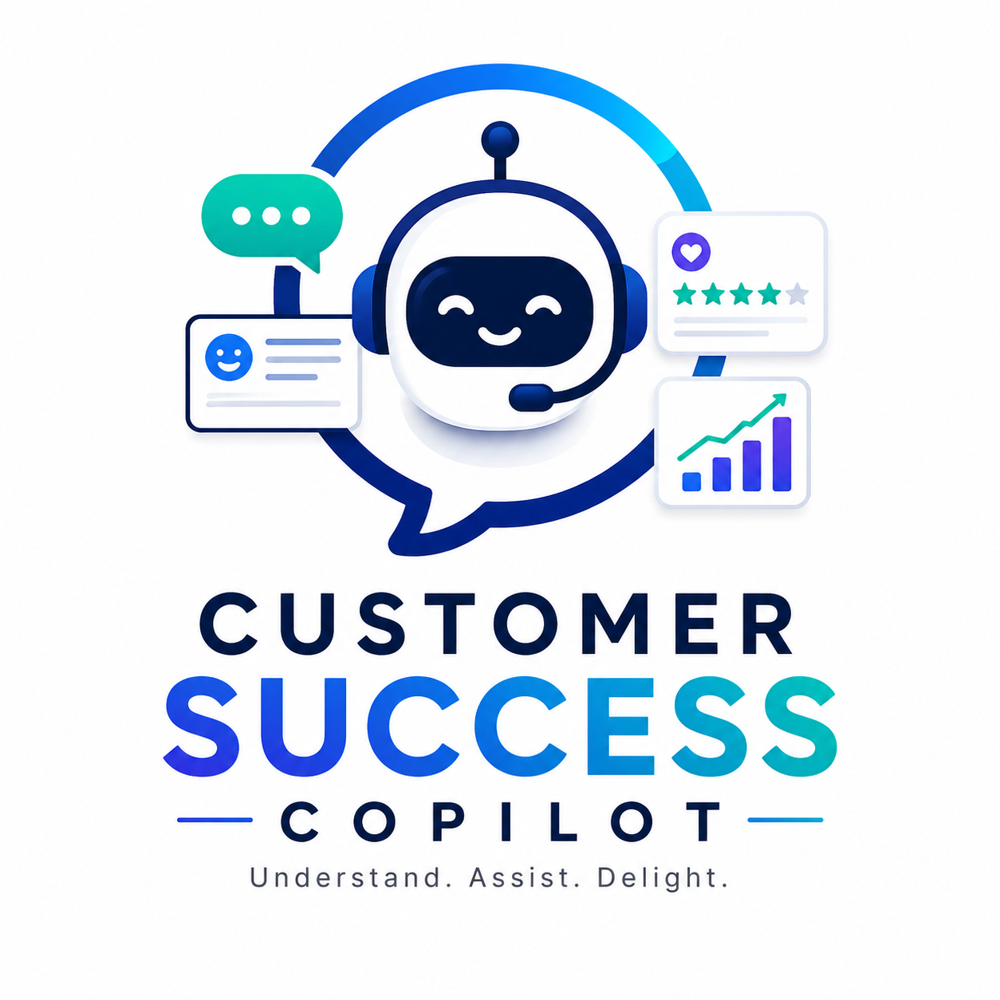

#  Customer Success Copilot
# AI Customer Success Copilot

A practical customer-support analysis tool built with Python and FastAPI. The app reads a customer message, identifies the likely issue, estimates churn risk, and suggests a useful next step for a support or customer-success team.

I built this project to show how customer conversations can be turned into simple, actionable insights instead of leaving teams to manually review every message.

---

## What This Project Does

Customer-success teams often deal with messages that look similar at first, but need very different responses. A billing complaint, a technical issue, and an upgrade request should not be handled the same way.

This project helps by reviewing each message and returning:

- Sentiment: positive, neutral, or negative
- Intent: billing concern, technical issue, cancellation risk, upgrade interest, or general support
- Urgency level
- Churn-risk score from 0 to 100
- Upsell opportunity flag
- Recommended next action
- Suggested response for the customer

The goal is not to replace a support team. The goal is to help teams prioritize faster and respond more consistently.

---

## Why I Built It

This project combines my interest in AI/ML with a real business use case: customer retention. It is designed like a small internal tool that a SaaS or service company could use to review incoming customer messages before assigning them to the right team.

It also demonstrates backend development, NLP-style text processing, API design, and clean project organization.

---

## Tech Stack

- Python
- FastAPI
- Uvicorn
- Pydantic
- Pandas
- Scikit-learn
- TextBlob
- Optional OpenAI integration
- Basic HTML dashboard for testing

---

## Project Structure

```text
ai-customer-success-copilot/
│
├── app/
│   ├── main.py
│   ├── api/
│   │   └── routes.py
│   ├── core/
│   │   └── config.py
│   ├── models/
│   │   └── schemas.py
│   └── services/
│       ├── analyzer.py
│       ├── llm_service.py
│       └── response_generator.py
│
├── data/
│   └── sample_tickets.csv
│
├── docs/
│   └── DEPLOYMENT.md
│
├── frontend/
│   └── index.html
│
├── notebooks/
│   └── exploratory_analysis.ipynb
│
├── tests/
│   └── test_analyzer.py
│
├── .env.example
├── .gitignore
├── LICENSE
├── requirements.txt
└── README.md
```

---

## Example

### Request

```json
{
  "customer_id": "CUST-1042",
  "message": "I have contacted support three times and my issue is still not fixed. I may cancel if this continues."
}
```

### Response

```json
{
  "customer_id": "CUST-1042",
  "sentiment": "Negative",
  "intent": "Cancellation Risk",
  "urgency": "High",
  "churn_risk_score": 92,
  "upsell_opportunity": false,
  "recommended_action": "Escalate to senior support immediately and follow up within 24 hours.",
  "suggested_reply": "Thank you for sharing this with us. I understand how frustrating this has been. I’m going to escalate this and make sure the right team reviews it quickly."
}
```

---

## How to Run Locally

### 1. Clone the repository

```bash
git clone https://github.com/your-username/ai-customer-success-copilot.git
cd ai-customer-success-copilot
```

### 2. Create a virtual environment

```bash
python -m venv venv
```

### 3. Activate the virtual environment

Mac/Linux:

```bash
source venv/bin/activate
```

Windows:

```bash
venv\Scripts\activate
```

### 4. Install dependencies

```bash
pip install -r requirements.txt
```

### 5. Run the API

```bash
uvicorn app.main:app --reload
```

### 6. Open the API docs

```text
http://127.0.0.1:8000/docs
```

---

## API Endpoints

### Health Check

```http
GET /
```

### Analyze One Message

```http
POST /api/analyze
```

### Analyze Sample Dataset

```http
GET /api/sample-analysis
```

---

## Optional OpenAI Setup

The project works without an OpenAI key. If an API key is added, the response-generation service can use it to produce more natural replies.

Create a `.env` file:

```env
OPENAI_API_KEY=your_api_key_here
USE_LLM=true
```

Without this setup, the app uses local response templates.

---

## Testing

```bash
pytest
```

---

## Future Improvements

- Add user login and role-based access
- Add a React dashboard
- Store analyzed messages in a database
- Add live ticket import from Zendesk or HubSpot
- Improve scoring with a trained classification model
- Add charts for churn-risk trends

---

## Resume Line

Built a FastAPI-based Customer Success Copilot that analyzes customer messages, detects intent and sentiment, estimates churn risk, and recommends next actions for support teams.

---

## License

This project is licensed under the MIT License.
